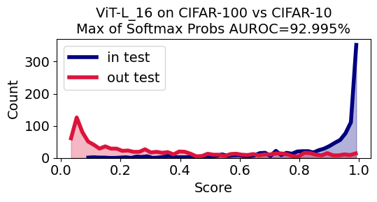
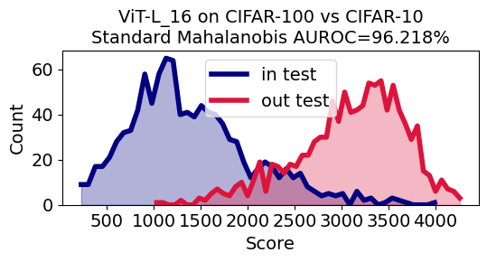
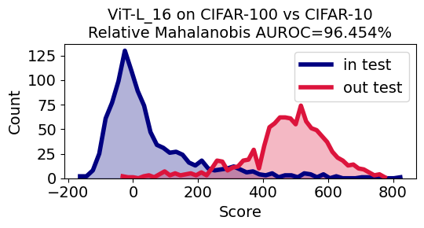

# Exploring the Limits of Out-of-Distribution Detection

In this repository we're collecting replications for the key experiments in the *Exploring the Limits of Out-of-Distribution Detection* paper by [Stanislav Fort](https://scholar.google.com/citations?user=eu2Kzn0AAAAJ&hl=en), [Jie Ren](https://scholar.google.com/citations?user=Os9wmpkAAAAJ&hl=en), [Balaji Lakshminarayanan](https://scholar.google.co.uk/citations?user=QYn8RbgAAAAJ&hl=en) that was [published at NeurIPS 2021](https://proceedings.neurips.cc/paper/2021/file/3941c4358616274ac2436eacf67fae05-Paper.pdf), [arXiv link](https://arxiv.org/abs/2106.03004).

The use of a large, pretrained and finetuned Vision Transformer for near-OOD detection on the CIFAR-100 vs CIFAR-10 task is demonstrated in [this Colab]. We showcase the use of the Standard Mahalanobis distance, the Relative Mahalanobis distance (presented in [this paper](https://arxiv.org/abs/2106.09022)), and the baseline Maximum of Softmax Probabilities. The results you should expect from running the Colab in full (in around 20 minutes on a free GPU instance) are shown in bellow. Prior to this paper, they would put you on top of the [task leaderboard](https://paperswithcode.com/sota/out-of-distribution-detection-on-cifar-100-vs).

|           Maximum over Softmax Probs            |              Standard Mahalanobis distance              |              *Relative* Mahalanobis distance              |
| :----------------------------------------------------------: | :----------------------------------------------------------: | :----------------------------------------------------------: |
|  |  |   |
